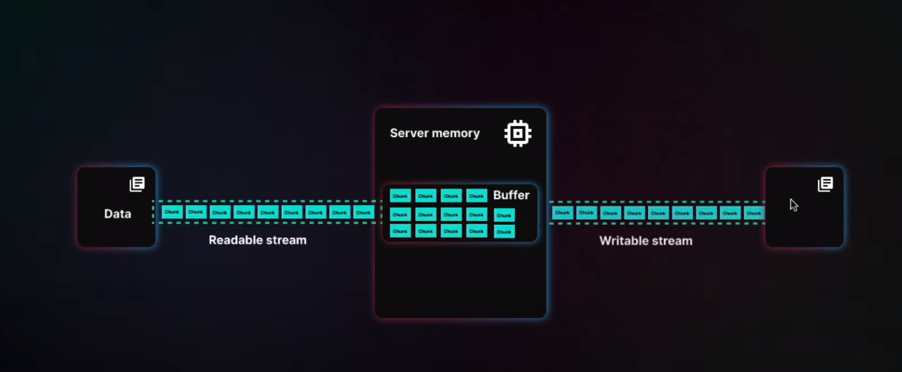

# Learning Streams
#### Credits Goes to : <a href= "https://www.youtube.com/watch?v=ZPwgbvCkRpY"> Coder's Gyan</a>

## Topic Covered
[+] Introduction <br>
- `Streams are one of the fundamental concepts of Node.js. Streams are a type of data-handling methods and are used to read or write input into output sequentially. Streams are used to handle reading/writing files or exchanging information in an efficient way.`



- `Some Node APIs that uses streams are:`
- - `net.Socket()`
- - `process.stdin()`
- - `process.stdout()`
- - `fs.createReadStream()`
- - `fs.createWriteStream()`
- - `http.request()`
- - `net.connect()`

<a href = "https://nodejs.org/api/stream.html#:~:text=A%20stream%20is%20an%20abstract,stdout%20are%20both%20stream%20instances.">
 For more details
</a>
<br>

[+] Streams are NOT ONLY for streaming videos/audios.<br>
[+] Understanding streams and buffers<br>
[+] Downloading big files from server (a good way and a bad way)<br>
```javascript
    // Downloading big file bad way

    const file = fs.readFileSync('temp.txt');
    // res.writeHead(200, { 'Content-Type': 'video/mp4' });  //for video
    return res.end(file);
```
```javascript

    //Downloading big file using good way (Streams)

    const readableStream = fs.createReadStream('temp.txt');
    // res.writeHead(200, { 'Content-Type': 'video/mp4' });  //for video
    readableStream.pipe(res);
```
[+] Copy files on file systems (a good way and a bad way)<br>
```javascript

    // Copy big file using bad way
    const file = fs.readFileSync('temp.txt');
    fs.writeFileSync('output.txt', file);
```
```javascript
    //  Copy big file good way
    const readStream = fs.createReadStream('temp.txt');
    const writeStream = fs.createWriteStream('output.txt');

    readStream.on('data', (chunk) => {
        console.log('vbv: ', chunk.toString());
        writeStream.write(chunk);
    });

    res.end();

```
[+] Create custom streams (Readable / Writable / Transform)<br>
```javascript
const {
    Readable,
    Writable
} = require("stream");


const readableStream = new Readable({
    highWaterMark : 5, // number of byte stream can have
    read() {}
});

const writableStream = new Writable({
    write(s){
        console.log('writting: ', s.toString())
    }
})

readableStream.on('data', (chunk) =>{
    console.log("data : ", chunk)
    writableStream.write(chunk);
})


console.log(readableStream.push(
    "name"
))
```
[+] String processing (a good way and a bad way)<br>
```javascript
    const readableStream = fs.createReadStream('temp.txt');
    const writableStream = fs.createWriteStream('output.txt');

    const finalString = new Transform({
        transform(chunk, encoding, callback){
            console.log(chunk);
            const badWordRemovedString = chunk.toString().replaceAll(/chunk/gi, "buffer").toUpperCase();
            callback(null, badWordRemovedString);

        }
    })

    readableStream.on('data',  (chunk) =>{
        console.log(chunk);
        const badWordRemovedString = chunk.toString().replaceAll(/chunk/gi, "buffer").toUpperCase();
        writableStream.write(badWordRemovedString);
    })
    readableStream.pipe(writableStream);

    
```
[+] Pipes<br>
```javascript
// inputStream.pipe(outputStream) follows this way
readableStream
    .pipe(processedString)
    .pipe(finalString)
    .pipe(writableStream)

// pipeline can also be used for same and better management

pipeline(
        readableStream,
        processedString,
        finalString,
        writableStream,
    );
  
```
[+] Types of streams<br>
- `There are mainly three type of strings`
- - `Readable Stream`
- - `writable Stream`
- - `transform Stream (Reading writing both at same time)`

[+] Object mode in streams<br>
-  `Javascript object can also be passed`
```javascript
    const readableStream = new Readable({
        objectMode : true,
        highWaterMark : 5, // number of object stream can have
        read() {}
    });

    console.log(readableStream.push({
        name : "Rakesh"
    }
   
))
```

[+] Handle errors in stream<br>

```javascript

// for simple pipe
    readableStream
    .pipe(processedString)
    .on("error", (err)=>{
        console.log(err);
    })
    .pipe(finalString)
    .on("error", (err)=>{
        console.log(err);
    })
    .pipe(writableStream)
    .on("error", (err)=>{
        console.log(err);
    });

// for pipeline
    pipeline(
        readableStream,
        processedString,
        finalString,
        writableStream,
        (err) =>{
            if(err){
                console.log("error handling here..", err);
            }
            
        }
    );

```
[+] Log text entered in terminal in log.txt

```javascript
const fs = require("fs");

 const writableStream = fs.createWriteStream("log.txt")

 process.stdin.pipe(writableStream);
 ```

 [+] output text entered in log.txt file in terminal
 ```javascript
 const fs = require("fs");

 const writableStream = fs.createWriteStream("log.txt");

fileReader.pipe(process.stdout);
 ```
